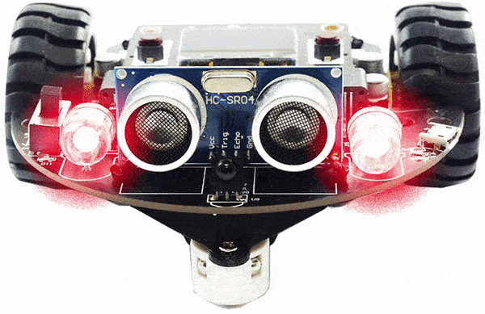

```template
\\
```
```package
brainbot
```
# BrainBot Lights

## Step 1 @unplugged

In this tutorial we'll make use of the BrainBot lights. You'll have to download your code to the BrainBot to see the results.  



## Step 2 @unplugged

In the tutorial the BrainBot extension is already loaded. If we are making our own BrainBot program we need to add the BrainBot extension. Under the 'Advanced' tab on the side menu at the very bottom click on 'Extensions' at the very bottom. Click on BrainBot to load the extension. 


## Step 3 @fullscreen

There are headlights and taillights on BrainBot. The headlights can be set to any color, but both headlights get set to the
same color. The combination of Red, Green, and Blue (RGB) is what makes up the final color. For example, blue
and red make purple. Drag the ``||brainbot:set headlights||`` block into the ``||loops:on start||``

```blocks
brainbot.HeadlightColor(255)
```

## Step 4 @fullscreen

We next to add another block inside the ``||brainbot:set headlights||`` block. Grab the ``||brainbot:red green blue color||`` selection block and put it inside the block we just added. 

```blocks
brainbot.HeadlightColor(brainbot.rgb(255, 255, 255))
```

## Step 5 @fullscreen
What about a program that shows different random colors? From Math, use the ``||math:pick random||`` block. Drag it into RED, GREEN, and Blue parameters of the block we just added. Download the code to the BrainBot and see what happens.

```blocks
brainbot.HeadlightColor(brainbot.rgb(randint(0, 255), randint(0, 255), randint(0, 255)))
```


## Step 6 @fullscreen
The two taillights can each be set to a different color. Let�s alternate the two lights red and blue. Something like a police car! Drag  in the ``||brainbot:set tailight||`` block into the ``||loops:forever||`` block. Drag in the ``||brainbot:red||`` parameter block. 

```blocks
forever(function () {
    brainbot.TaillightColor(brainbot.TurnDirection.Left, brainbot.colors(NeoPixelColors.Red))
})
```

## Step 7 @fullscreen
Next drag in another ``||brainbot:set tailight||`` block inside the ``||loops:forever||`` block, change it from left to right. Drag in the ``||brainbot:red||`` parameter block this time change it to blue. 

```blocks
forever(function () {
    brainbot.TaillightColor(brainbot.TurnDirection.Left, brainbot.colors(NeoPixelColors.Red))
    brainbot.TaillightColor(brainbot.TurnDirection.Right, brainbot.colors(NeoPixelColors.Blue))
})
```

## Step 8 @fullscreen
We need to add a brief pause between the ``||brainbot:set tailight||`` block. Put one between the two blocks and one at the bottom of the ``||loops:forever||`` block. Download the code to the BrainBot and observe the results.

```blocks
forever(function () {
    brainbot.TaillightColor(brainbot.TurnDirection.Left, brainbot.colors(NeoPixelColors.Red))
    pause(100)
    brainbot.TaillightColor(brainbot.TurnDirection.Right, brainbot.colors(NeoPixelColors.Blue))
    pause(100)
})
```
