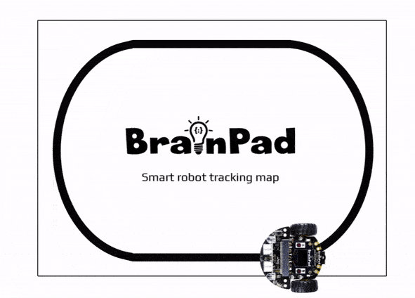

```template
\\
```
```package
brainbot
```
# BrainBot Line Follower

## Step 1 @unplugged

In this tutorial we'll program the BrainPulse to follow a line using the BrainBot.  



## Step 2 @unplugged

In the tutorial the BrainBot extension is already loaded. If we are making our own BrainBot program we need to add the BrainBot extension. Under the 'Advanced' tab on the side menu at the very bottom click on 'Extensions' at the very bottom. Click on BrainBot to load the extension. 


## Step 3 @fullscreen

Since we want to detect where the line is over and over again all our code will go inside the ``||loops:forever||`` loop. The first block we need to add is an ``||logic:if-then||`` block. 

```blocks
forever(function () {
    if (true) {
    	
    }
})
```
## Step 4 @fullscreen

We're going to add the ``||brainbot:line detected||`` block into the ``||logic:if-then||`` block where ``||logic:true||`` is. We can leave it set to ``||brainbot:none||``

```blocks
forever(function () {
    if (brainbot.ReadGroundSensor(GroundSensorDetected.None)) {
    	
    }
})
```
## Step 5 @fullscreen

Since the line detecting sensors are on either side of the line, we want to move forward when NO LINE is detected. This may seem odd, at first, but it's because the sensors are reading the white space. As long as both sensors read white then line is directly in the middle. This of course assumes we place the BrainBot on the line. 
So let's move forward as long as the sensors don't contact the line. Add a ``||brainbot:Move||`` block. Keep the direction ``||brainbot:forward||``, but change the speed to 25. 

```blocks
forever(function () {
    if (brainbot.ReadGroundSensor(GroundSensorDetected.None)) {
        brainbot.Move(brainbot.MoveDirection.Forward, 25)
    }
})
```
## Step 6 @fullscreen

We're going to add another condition to the ``||logic:if-then||`` block. Click on the ``||logic:+||`` twice located at the bottom of the block until we see another empty condition. This will check for another condition. Inside this condition 
add another ``||brainbot:line detected||`` block. This time set it to ``||brainbot:right||``. 

```blocks
forever(function () {
    if (brainbot.ReadGroundSensor(GroundSensorDetected.None)) {
        brainbot.Move(brainbot.MoveDirection.Forward, 25)
    } else if (brainbot.ReadGroundSensor(GroundSensorDetected.Right)) {
    	
    }
})
```
## Step 7 @fullscreen

When the line is detected right, we need to turn to the right. Add the ``||brainbot:Turn||`` block set it to ``||brainbot:right||`` and speed 25. 

```blocks
forever(function () {
    if (brainbot.ReadGroundSensor(GroundSensorDetected.None)) {
        brainbot.Move(brainbot.MoveDirection.Forward, 25)
    } else if (brainbot.ReadGroundSensor(GroundSensorDetected.Right)) {
        brainbot.Turn(brainbot.TurnDirection.Right, 25)
    }
})
```
## Step 8 @fullscreen

Now let's add another condition to check inside the ``||logic:if-then||`` block. This time we'll check on the '``||brainbot:left||``. You'll need to click the ``||logic:+||`` at the bottom again. Add ``||brainbot:line detected||`` block and set it to the ``||brainbot:left||`` this time.

```blocks
forever(function () {
    if (brainbot.ReadGroundSensor(GroundSensorDetected.None)) {
        brainbot.Move(brainbot.MoveDirection.Forward, 25)
    } else if (brainbot.ReadGroundSensor(GroundSensorDetected.Right)) {
        brainbot.Turn(brainbot.TurnDirection.Right, 25)
    } else if (brainbot.ReadGroundSensor(GroundSensorDetected.Left)) {
    	
    } else {
    	
    }
})
```
## Step 9 @fullscreen

Next add ``||brainbot:Turn||`` block set it to ``||brainbot:left||`` and speed 25. 

```blocks
forever(function () {
    if (brainbot.ReadGroundSensor(GroundSensorDetected.None)) {
        brainbot.Move(brainbot.MoveDirection.Forward, 25)
    } else if (brainbot.ReadGroundSensor(GroundSensorDetected.Right)) {
        brainbot.Turn(brainbot.TurnDirection.Right, 25)
    } else if (brainbot.ReadGroundSensor(GroundSensorDetected.Left)) {
        brainbot.Turn(brainbot.TurnDirection.Left, 25)
    } else {
    	
    }
})
```
## Step 10 @fullscreen

The last thing we should add to ``||logic:if-then||`` block is something inside to do if none of the the other conditions are ``||logic:true||``. Add a ``||brainbot:Stop||`` block under the ``||logic:else||`` condition. 

```blocks
forever(function () {
    if (brainbot.ReadGroundSensor(GroundSensorDetected.None)) {
        brainbot.Move(brainbot.MoveDirection.Forward, 25)
    } else if (brainbot.ReadGroundSensor(GroundSensorDetected.Right)) {
        brainbot.Turn(brainbot.TurnDirection.Right, 25)
    } else if (brainbot.ReadGroundSensor(GroundSensorDetected.Left)) {
        brainbot.Turn(brainbot.TurnDirection.Left, 25)
    } else {
        brainbot.Stop()
    }
})
```
## Step 10 @unplugged

That's it. Place the BrainBot on the line map or other line and watch it go. The BrainBot has become smarter thanks to the code we added. 

