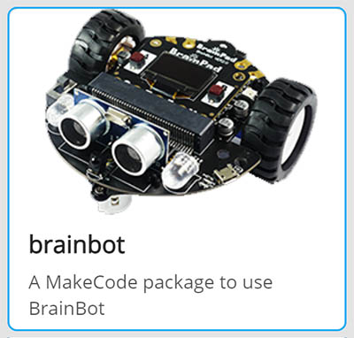

```template
\\
```
```package
brainbot
```
# BrainBot Line Follower

## Step 1 @unplugged

In this tutorial teach the BrainPulse how to follow a line using the BrainBot.  


## Step 2 @unplugged

In the tutorial the BrainBot extension is already loaded. If we are making our own BrainBot program we need to add the BrainBot extension. Under the 'Advanced' tab on the side menu at the very bottom click on 'Extensions' at the very bottom. Click on BrainBot to load the extension. 



## Step 3 @fullscreen

Since we want to detect where the line is over and over again all our code will go inside the ``||loops:forever||`` loop. The first block we need to add is an ``||logic:if-then||`` block. 

```blocks
forever(function () {
    if (true) {
    	
    }
})
```
## Step 4 @fullscreen

We're going to add the ``||brainbot:line detected||`` block into the ``||logic:if-then||`` block where ``||logic:true||``. We can leave it set to ``||brainbot:none||``

```blocks
forever(function () {
    if (brainbot.ReadGroundSensor(GroundSensorDetected.None)) {
    	
    }
})
```
## Step 4 @fullscreen

Since the line detecting sensors are on either side of the line, we want to move forward when NO LINE is detected. This may seem odd, at first, but it's because the sensors are reading the white space. As long as both sensors read white then line is directly in the middle. This of course assumes we place the BrainBot right on the line. 
So let's move forward as long as the sensors don't contact the line. Add a ``||brainbot:

```blocks
forever(function () {
    if (brainbot.ReadGroundSensor(GroundSensorDetected.None)) {
    	
    }
})
```