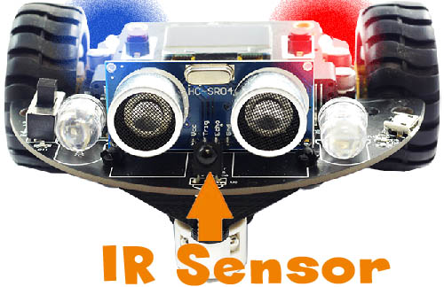
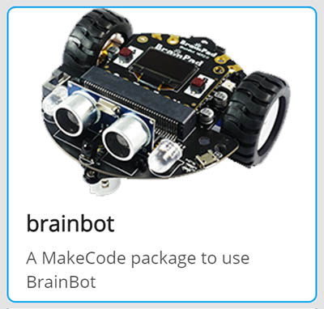

```template
\\
```
```package
brainbot
```
# BrainBot Infrared

## Step 1 @unplugged

The BrainBot kit includes an infrared remote. It can be used to control our BrainBot. Keep in mind that IR remotes are directional and must point towards the sensor, which is located between the distance sensors. 



## Step 2 @unplugged

In the tutorial the BrainBot extension is already loaded. If we are making our own BrainBot program we need to add the BrainBot extension. Under the 'Advanced' tab on the side menu at the very bottom click on 'Extensions' at the very bottom. Click on BrainBot to load the extension. 



## Step 3 @fullscreen

Controlling the BrainBot with the remote is pretty simple. Grab the ``||brainbot:on reciever button||`` event block. You'll notice in the dropdown menu of the block you can set the event to any of the buttons pressed on the remote. 

```blocks
brainbot.onPressEvent(RemoteButton.PowerOff, function () {
	
})
```
## Step 4 @fullscreen

Let's first set up the button we'll use to STOP the BrainBot when we make it move. Change the dropdown menu in the block to read the ``||brainbot:Zero||`` button. Drag in the ``||brainbot:Stop||`` block. 
Now pressing the zero button will make the Brainbot stop. 

```blocks
brainbot.onPressEvent(RemoteButton.Zero, function () {
    brainbot.Stop()
})
```

## Step 5 @fullscreen

Let's move the BrainBot when we press the up arrow. It's as easy as dragging in another ``||brainbot:on reciever button||`` event block change this one to read the ``||brainbot:Up||`` button and drag in the ``||brainbot:move forward||`` block.
You can leave the speed at 50. Depoy the code to the BrainBot to see the results. 

```blocks
brainbot.onPressEvent(RemoteButton.Up, function () {
    brainbot.Move(brainbot.MoveDirection.Forward, 50)
})

```
## Step 6 @fullscreen

Drag in another ``||brainbot:on reciever button||`` event block. This time let's use the down arrow to make the BrainBot move backwards. Change the value in the dropdown to ``||brainbot:Down||``. Drag in a ``||brainbot:move forward||`` block. This time
change the direction to ``||brainbot:back||``. We can leave the speed at 50. 

```blocks
brainbot.onPressEvent(RemoteButton.Down, function () {
    brainbot.Move(brainbot.MoveDirection.Back, 50)
})

```
## Step 7 @fullscreen

The IR Remote can be also be used to control the LEDs. Let's use the Lightbulb button on the remote to turn on the front headlights and the PowerOff button to turn them off. As before drag in another ``||brainbot:on reciever button||`` event block. Change the
dropdown to ``||brainbot:PowerOn||``. Drag in another ``||brainbot:on reciever button||`` event block and change this one to read the PowerOff button. Inside the ``||brainbot:Power On||`` block. Drag in the
``||brainbot:Set headlight color to||`` block inside. We can leave the value at 255. In the ``||brainbot:PowerOff||`` event block drag in another ``||brainbot:Set headlight color to||`` block set the value in this one to ``||brainbot:0||``.

```blocks
brainbot.onPressEvent(RemoteButton.PowerOn, function () {
    brainbot.HeadlightColor(255)
})

brainbot.onPressEvent(RemoteButton.PowerOff, function () {
    brainbot.HeadlightColor(0)
})
```

## Step 8 @fullscreen

We can use the IR Remote to also play music on the BrainPad Pulses' built in buzzer. Time for another ``||brainbot:on reciever button||`` event block. Change the dropdown on this one to read the ``||brainbot:center||`` button press. 
The center button is the one with the speaker on the remote. Next drag in a ``||music:play sound||`` block into the event block. 

```blocks
brainbot.onPressEvent(RemoteButton.Center, function () {
    music.playSound(music.sounds(Sounds.PowerUp))
})
```

## Step 9 @fullscreen

You now understand how the IR remote works with the BrainBot and Pulse. You can also change the display too. Inside the blocks that control the BrainBot's movement drag in ``||display:show image||`` block. Add one to each of the directions and change the images to arrows that represent the direction that the BrainBot is moving. 

```blocks
brainbot.onPressEvent(RemoteButton.PowerOn, function () {
    brainbot.HeadlightColor(255)
    display.showImage(background.img01_logo1)
})
brainbot.onPressEvent(RemoteButton.Zero, function () {
    brainbot.Stop()
    display.showImage(background.img30_stop)
})
brainbot.onPressEvent(RemoteButton.Center, function () {
    music.playSound(music.sounds(Sounds.PowerUp))
    display.showImage(background.img03_heart1)
})
brainbot.onPressEvent(RemoteButton.Up, function () {
    brainbot.Move(brainbot.MoveDirection.Forward, 50)
    display.showImage(background.img38_down)
})
brainbot.onPressEvent(RemoteButton.PowerOff, function () {
    brainbot.HeadlightColor(0)
    display.showImage(background.img02_logo)
})
brainbot.onPressEvent(RemoteButton.Down, function () {
    brainbot.Move(brainbot.MoveDirection.Back, 50)
    display.showImage(background.img37_up)
})
```
## Step 10 @unplugged

That's It! Try adding more blocks to do things like make the BrainBot turn left or right, also try adding one to make it spin around and dance and control the taillights. 


