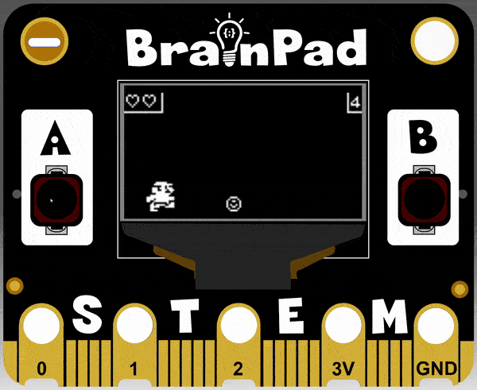
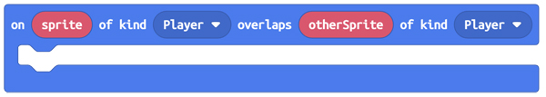
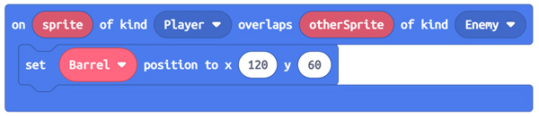
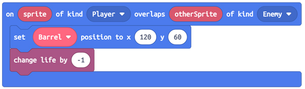
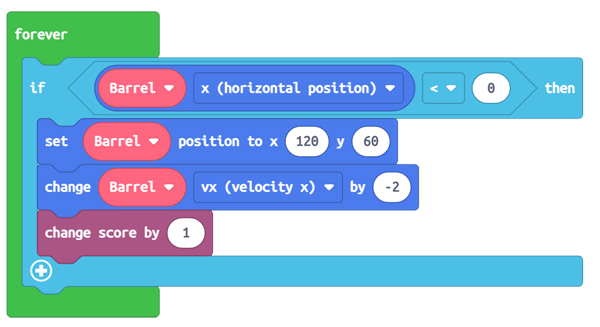
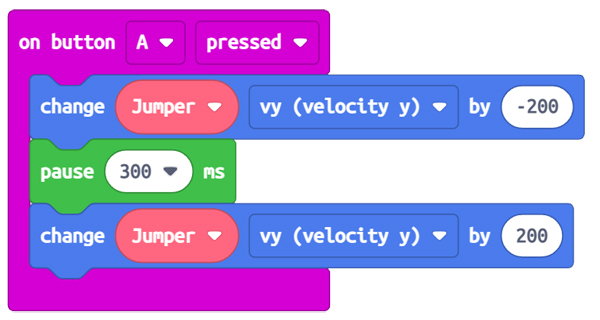
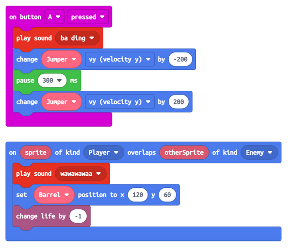

```template
enum SpriteKind {
    Player,
    Enemy
}
enum ActionKind {
    Walking,
    Idle,
    Jumping,
    Rolling,
    Jump,
    Swimming
}
input.buttonA.onEvent(ButtonEvent.Down, function () {
    Jumper.vy += -200
})
input.buttonA.onEvent(ButtonEvent.Up, function () {
    Jumper.vy += 200
})
let Jumper: Sprite = null
Jumper = sprites.create(img`
    . . . . . . . . . . . . . . . . 
    . . . . 1 1 1 1 1 1 . . . . . . 
    . . . 1 1 1 1 1 1 1 1 1 1 . . . 
    . . . . . . . 1 1 . 1 . . . . . 
    . . 1 1 1 . 1 1 1 . 1 1 1 . . . 
    . . 1 1 1 . . 1 1 1 . 1 1 1 . . 
    . . 1 1 1 1 1 1 1 . . . 1 . . . 
    . . . . 1 1 1 1 1 1 1 1 . . . . 
    . . . 1 1 1 1 1 1 1 . . . . . . 
    . . 1 1 1 1 1 1 1 1 1 . . . . . 
    . . 1 1 . . . 1 1 1 1 . . . . . 
    . . 1 1 . . 1 1 1 1 1 . . . . . 
    . . 1 1 . . 1 1 1 1 1 . . . . . 
    . . . 1 1 . 1 1 . 1 . . . . . . 
    . . . . 1 1 1 . 1 1 1 . . . . . 
    . . . . 1 1 1 1 1 . . . . . . . 
    `, SpriteKind.Player)
let Barrel = sprites.create(img`
    . . 1 1 1 1 . . 
    . 1 . . . . 1 . 
    1 . . 1 . . . 1 
    1 . 1 . . . . 1 
    1 . . . 1 . . 1 
    1 . . . . . . 1 
    . 1 . . . . 1 . 
    . . 1 1 1 1 . . 
    `, SpriteKind.Enemy)
let anim = animation.createAnimation(ActionKind.Walking, 200)
let rolling = animation.createAnimation(ActionKind.Walking, 200)
anim.addAnimationFrame(img`
    . . . . 1 1 1 1 1 1 . . . . . . 
    . . . 1 1 1 1 1 1 1 1 1 1 . . . 
    . . . . . . . 1 1 . 1 . . . . . 
    . . 1 1 1 . 1 1 1 . 1 1 1 . . . 
    . . 1 1 1 . . 1 1 1 . 1 1 1 . . 
    . . 1 1 1 1 1 1 1 . . . 1 . . . 
    . . . . 1 1 1 1 1 1 1 1 . . . . 
    . . . 1 1 1 1 1 1 1 . . . . . . 
    . . 1 1 1 1 1 1 1 1 1 . . . . . 
    . . 1 1 . . . 1 1 1 1 . . . . . 
    . . 1 1 . . 1 1 1 1 1 . . . . . 
    . . 1 1 . . 1 1 1 1 1 . . . . . 
    . . . 1 1 . 1 1 . 1 . . . . . . 
    . . . . 1 1 1 . 1 1 1 . . . . . 
    . . . . 1 1 1 1 1 . . . . . . . 
    `)
anim.addAnimationFrame(img`
    . . . . . 1 1 1 1 1 1 . . . . . 
    . . . . 1 1 1 1 1 1 1 1 1 1 . . 
    . . . . . . . . 1 1 . 1 . . . . 
    . . . 1 1 1 . 1 1 1 . 1 1 . . . 
    . . . 1 1 1 1 . 1 1 1 . 1 1 1 . 
    . . . 1 1 1 1 1 1 1 . . . 1 . . 
    . . . . . 1 1 1 1 1 1 1 1 . . . 
    . . . . . . 1 1 1 1 1 1 . . . . 
    . . . . . 1 1 1 1 1 1 1 1 . . . 
    . . . 1 1 1 1 1 1 1 1 1 1 1 1 . 
    . . 1 1 1 1 1 1 1 1 1 1 1 . . . 
    . . 1 1 . . . . . . . . 1 . . . 
    . . . 1 1 1 . 1 1 1 . 1 1 . . . 
    . . 1 1 1 1 1 . 1 1 1 1 . . . . 
    . . 1 1 . . . . 1 1 1 . . . . . 
    . . . . . . . . 1 1 1 1 . . . . 
    `)
anim.addAnimationFrame(img`
    . . . . . . . . . . . . . . . . 
    . . . . 1 1 1 1 1 1 . . . . . . 
    . . . 1 1 1 1 1 1 1 1 1 1 . . . 
    . . . . . . . 1 1 . 1 . . . . . 
    . . 1 1 1 . 1 1 1 . 1 1 1 . . . 
    . . 1 1 1 . . 1 1 1 . 1 1 1 . . 
    . . 1 1 1 1 1 1 1 . . . 1 . . . 
    . . . . 1 1 1 1 1 1 1 1 . . . . 
    . . . 1 1 1 1 1 1 1 . . . . . . 
    . . 1 1 1 1 1 1 1 1 1 . . . . . 
    . . 1 1 1 1 1 1 1 1 1 . . . . . 
    . . 1 1 . . . . . . 1 . . . . . 
    . . 1 . 1 1 1 1 . 1 . . . . . . 
    . . . 1 1 1 . 1 1 1 1 1 . . . . 
    . . . . 1 1 . . 1 1 1 1 . . . . 
    . . . . 1 1 1 1 . . . . . . . . 
    `)
anim.addAnimationFrame(img`
    . . . . . 1 1 1 1 1 1 . . . . . 
    . . . . 1 1 1 1 1 1 1 1 1 1 . . 
    . . . . . . . . 1 1 . 1 . . . . 
    . . . 1 1 1 . 1 1 1 . 1 1 1 . . 
    . . . 1 1 1 . . 1 1 1 . 1 1 1 . 
    . . . 1 1 1 1 1 1 1 . . . 1 . . 
    . . . . . 1 1 1 1 1 1 1 1 . . . 
    . . 1 1 1 1 1 1 1 1 1 1 . . . . 
    1 1 1 1 1 1 1 1 1 1 1 1 1 1 1 . 
    1 1 1 1 . 1 1 1 1 1 1 1 1 1 1 . 
    1 1 . . 1 1 1 1 1 1 1 1 . . . . 
    . . . 1 . . . . . . . 1 . 1 1 . 
    . . 1 1 . 1 1 1 1 1 . . 1 1 1 . 
    . . 1 1 1 1 1 . . . 1 1 1 1 1 . 
    . . 1 1 . . . . . . . . . . . . 
    . . 1 1 1 1 . . . . . . . . . . 
    `)
rolling.addAnimationFrame(img`
    . . 1 1 1 1 . . 
    . 1 . . . . 1 . 
    1 . . 1 . . . 1 
    1 . 1 . . 1 . 1 
    1 . 1 . . 1 . 1 
    1 . . 1 . . . 1 
    . 1 . . . . 1 . 
    . . 1 1 1 1 . . 
    `)
rolling.addAnimationFrame(img`
    . . 1 1 1 1 . . 
    . 1 . . . . 1 . 
    1 . . 1 1 . . 1 
    1 . 1 . . 1 . 1 
    1 . . . . . . 1 
    1 . . 1 1 . . 1 
    . 1 . . . . 1 . 
    . . 1 1 1 1 . . 
    `)
rolling.addAnimationFrame(img`
    . . 1 1 1 1 . . 
    . 1 . . . . 1 . 
    1 . . . 1 . . 1 
    1 . 1 . . 1 . 1 
    1 . 1 . . 1 . 1 
    1 . . . 1 . . 1 
    . 1 . . . . 1 . 
    . . 1 1 1 1 . . 
    `)
rolling.addAnimationFrame(img`
    . . 1 1 1 1 . . 
    . 1 . . . . 1 . 
    1 . . 1 1 . . 1 
    1 . . . . . . 1 
    1 . 1 . . 1 . 1 
    1 . . 1 1 . . 1 
    . 1 . . . . 1 . 
    . . 1 1 1 1 . . 
    `)
animation.attachAnimation(Jumper, anim)
animation.attachAnimation(Barrel, rolling)
animation.setAction(Jumper, ActionKind.Walking)
animation.setAction(Barrel, ActionKind.Walking)
Jumper.setPosition(20, 55)
Barrel.setPosition(120, 60)
Jumper.setFlag(SpriteFlag.StayInScreen, true)
Barrel.vx = -50
forever(function () {
    if (Barrel.x < 0) {
        Barrel.setPosition(120, 60)
        Barrel.vx += -2
    }
})

```

# Detecting Collision

## Step 1 @unplugged

Now we're going to add more barrels and detect when a ``||sprites:Barrel||`` and ``||sprites:Jumper||`` collide. 



## Step 2 @fullscreen

We've added a ``||loops:forever||`` loop and an ``||logic:if-then||`` block to our program. Now the when the ``||sprites:Barrel||`` reaches the end of the screen, it starts over and gets faster each time. To make it a game
let's add a ``||info:set life to 3||`` block and ``||info:set score to 0||`` block at the top of the ``||loops:on start||`` block. 

```blocks
enum SpriteKind {
    Player,
    Enemy
}
enum ActionKind {
    Walking,
    Idle,
    Jumping,
    Rolling,
    Jump,
    Swimming
}
info.setLife(3)
info.setScore(0)
let Jumper = sprites.create(img`
    . . . . . . . . . . . . . . . . 
    . . . . 1 1 1 1 1 1 . . . . . . 
    . . . 1 1 1 1 1 1 1 1 1 1 . . . 
    . . . . . . . 1 1 . 1 . . . . . 
    . . 1 1 1 . 1 1 1 . 1 1 1 . . . 
    . . 1 1 1 . . 1 1 1 . 1 1 1 . . 
    . . 1 1 1 1 1 1 1 . . . 1 . . . 
    . . . . 1 1 1 1 1 1 1 1 . . . . 
    . . . 1 1 1 1 1 1 1 . . . . . . 
    . . 1 1 1 1 1 1 1 1 1 . . . . . 
    . . 1 1 . . . 1 1 1 1 . . . . . 
    . . 1 1 . . 1 1 1 1 1 . . . . . 
    . . 1 1 . . 1 1 1 1 1 . . . . . 
    . . . 1 1 . 1 1 . 1 . . . . . . 
    . . . . 1 1 1 . 1 1 1 . . . . . 
    . . . . 1 1 1 1 1 . . . . . . . 
    `, SpriteKind.Player)
let Barrel = sprites.create(img`
    . . 1 1 1 1 . . 
    . 1 . . . . 1 . 
    1 . . 1 . . . 1 
    1 . 1 . . . . 1 
    1 . . . 1 . . 1 
    1 . . . . . . 1 
    . 1 . . . . 1 . 
    . . 1 1 1 1 . . 
    `, SpriteKind.Enemy)

    forever(function () {
    if (Barrel.x < 0) {
        Barrel.setPosition(120, 60)
        Barrel.vx += -2
    }
})
```
## Step 3 @fullscreen
Now let's detect when a Barrel and our Jumper over lap and then remove one life from the game. We need to drag in an ``||sprite:overlap||`` event block. We only need to change the last parameter from ``||sprite:Enemy||`` to ``||sprite:Player||``.




## Step 4 @fullscreen
Inside the ``||sprite:overlap||`` event block. We need to add blocks that will only run when the Player overlaps with an Enemy. The first thing to do is send the ``||sprite:Barrel||`` back to the starting position. Grab the ``||sprite:set mySprite position||`` block and drag it into the ``||sprite:overlap||`` event block.
Change the ``||sprite:x||`` to 120 and the ``||sprite:y||`` to 60. This will move the ``||sprite:Barrel||`` back to the start position. 



## Step 5 @fullscreen
Now that the ``||sprite:Barrel||`` goes back to the start position. Let's take away one life from the ``||sprite:Jumper||``. We only need to add a ``||info:change life by -1||`` block. This will subtract a life everytime there's an overlap.
We can verify this by watching the simulator. The ``||sprite:Barrel||`` will overlap the ``||sprite:Jumper||`` 3 times and then end the game. 




## Step 6 @fullscreen
We need to change our score everytime the ``||sprite:Jumper||`` successfully jumps over a ``||sprite:Barrel||``. We can do this by just changing the score when the ``||sprite:Barrel||`` reaches the end of the screen. We already have an ``||logic:if-then||`` block in the ``||loops:forever||`` block to check for this. So lets put it there. 
Grab the ``||info:change score by 1||`` block and drag it into the ``||logic:if-then||``.




## Step 7 @fullscreen
We're almost there. There is a small bug in our code. If we hold down the A button our ``||sprite:Jumper||`` will always stay in the air. We can fix this buy adding a ``||loops:pause||`` and ``||sprite:set mySprite x(horizontal position)||`` block. 
Set the ``||loops:pause||`` to 300 milliseconds. Then change the ``||sprite:set mySprite x(horizontal position)||`` block to ``||sprite:Jumper||`` and select ``||sprite:vy (velociy y)||`` and change to 200. This will bring the ``||sprite:Jumper||``
back to the ground after 300 milliseconds. 



## Step 8 @fullscreen
We have a game. For one last finishing touch lets add a couple sounds to the game. When the ``||sprite:Jumper||`` jumps and when a there is a collision. First drag in a ``||music:play sound||`` at the top of the ``||input:on button A pressed||`` event block. Change the sound it will play to ``||music:ba ding||``. In the ``||sprite:overlap||`` event block drag another ``||music:play sound||`` block at into it at the top. Change the sound it plays to ``||music:wawawaa||``. 




## Step 9 @unplugged
That's it. We have a fully playable game. Now that you understand how things go together, you can make it your own buy creating your own sprites. 

