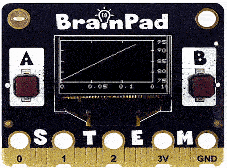

# Text

## Step 1 @unplugged

The BrainPad Pulse's display allows for lots of display options. One of them is graphing data from sensors. Graphing is built in we just need to decide what data we want to send to the graph. 




## Step 2 @fullscreen

When graphing we need to continously read the values we're going graph on the display. We'll use the ``||loops:forever||`` loop to do this. To add graphing to the display we simply need to drag in the ``||display:graph||`` block. 

```blocks
forever(function () {
    display.graph(0)
})
```

## Step 3 @fullscreen

We're going to graph data from the BrainPad Pulse's on board accelerometer. Drag in the ``||input:acceleration||`` block into the ``||display:graph||`` block we just added.

```blocks
forever(function () {
    display.graph(input.acceleration(Dimension.X))
})
```
## Step 4 @fullscreen

We won't see anything on the simulator and will need a physical BrainPad Pulse to view the affects of the code. Download the project to your Pulse and see what happens when you tip it a certain way.   

## Step 5 @fullscreen

Change the value inside the acceleration ``||input:accleration||`` block. Download again and see what happens. Do you notice anything different between the two blocks?

```blocks
forever(function () {
    display.graph(input.acceleration(Dimension.Y))
})
```

## Step 6 @unplugged

That's it. What other things do you think you might be able to graph? If you have a BrainClip kit you can use values from several of the sensors and graph them. 


