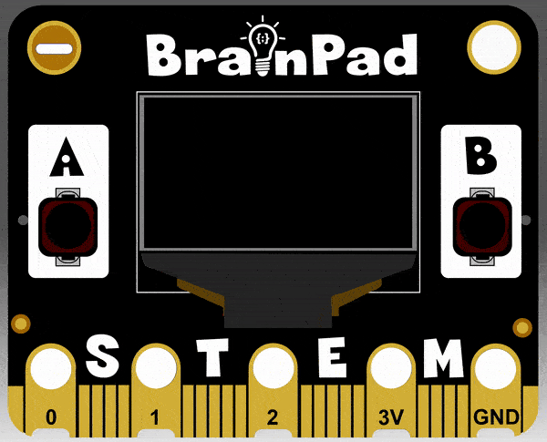

```ghost
let offset = 0
let pointY = 0
let picture = image.screenImage()
let pointX = 50
forever(function () {
    picture.setPixel(50, 10, 1)
    picture.drawRect(65, 10, 20, 20, 1)
    picture.fillRect(32, 4, 10, 10, 1)
    picture.drawLine(0, pointY, 128, 64, 1)
    picture.setPixel(100, pointY, 1)
    pointX += 2
    pointY += 2
    offset += 4
})

```

# Images

## Step 1 @unplugged

Drawing images and shapes can be done using image tools. Using these tools we can create lines, pixels, and rectangles. One advantage to using this method of drawing is math art can be created. 
One thing to keep in mind, images created this way can't be used in games. Game images have to be created as SPRITES or SCENES.   



## Step 2 @fullscreen

The first thing that needs to be done is we need to create a variable that represents the screen. We do this just like creating any other variable. Go to `Varables` and create a new variable 
called ``||variables:picture||``. Once created drag in the ``||variables:set picture||`` block into the ``||loops:on start||`` block. 

```blocks
let picture = 0
```

## Step 3 @fullscreen

The next step we need to do is change the type of variable we're creating. Currently the variable ``||variables:picture||`` is set to a number. We need to make it a ``||images:screen||``. We simply
change the type by going under `images` and selecting ``||images:screen||``. Now the ``||variables:picture||`` variable is set to the type ``||images:screen||``.

```blocks
let picture = image.screenImage()
```

## Step 4 @fullscreen

The screen is now ready to draw on. The most basic element to draw is a single pixel using the ``||images:set picture color at x y||``. Set the x to 50 and y to 10. The last parameter is the 
color of the pixel either black or white. If you look VERY closely on the simulator you'll see a single pixel on the screen. Put this inside ``||loops:forever||`` loop.

```blocks
forever(function () {
    picture.setPixel(50, 10, 1)
})
```

## Step 5 @fullscreen

We can use the ``||images:draw rectangle||`` block to make rectangles of anysize. Grab the block and drag it into the ``||loops:forever||`` loop. Set the x to 65 and y to 10. Also set the width and height
both to 20. Don't forget to change the color we're drawing the in to white. Once complete you'll have a dot and a rectangle on the screen.

```blocks
forever(function () {
    picture.setPixel(50, 10, 1)
    picture.drawRect(65, 10, 20, 20, 1)
})
```

## Step 6 @fullscreen

Let's create 2 varables so we can manipulate the x and y of the images we're drawing. Under the Variables menu click on ``||variables:Make a Variable...||``. Create one called ``||variables:pointX||``, and one called ``||variables:pointY||``. Drag in two ``||variables:set||`` blocks into the
``||loops:on start||`` change the dropdown to both our ``||variables:pointX||`` & ``||variables:pointY||`` variables. Set ``||variables:pointX||`` to 65. We can leave ``||variables:pointY||`` for now. 

```blocks
let picture = image.screenImage()
let pointX = 65
let pointY = 0
```

## Step 7 @fullscreen

This is where we see the advantages of using our drawing tools. Drag in the ``||variables:pointX||`` & ``||variables:pointY||`` into the x and y of our ``||images:draw rectangle||`` block. Let's 
also drag in two ``||variables:change by||`` blocks and change the drop down of the block to ``||variables:pointX||`` & ``||variables:pointY||`` and set both to change by 2. 

```blocks
forever(function () {
    picture.setPixel(50, 10, 1)
    picture.drawRect(pointX, pointY, 20, 20, 1)
    pointX += 2
    pointY += 2
})
```

## Step 8 @fullscreen

The drawing tools also has a line tool. This allows us to draw a line from one point on the screen to another. Drag in the ``||images:draw line||`` block just below our other drawing blocks in the ``||loops:forever||`` loop.
Let's draw the line from the top left to bottom right of the screen. set the first x & y to 0, and the second x to 128 and y 64. Change the drawing color to white. 

```blocks
forever(function () {
    picture.setPixel(50, 10, 1)
    picture.drawRect(pointX, pointY, 20, 20, 1)
    picture.drawLine(0, 0, 128, 64, 1)
    pointX += 2
    pointY += 2
})
```
## Step 9 @fullscreen

We should have a line going from the top corner to the bottom corner of the screen. To make things fun, drag ``||variables:pointY||`` variable into first y value of the block. 

```blocks
forever(function () {
    picture.setPixel(50, 10, 1)
    picture.drawRect(pointX, pointY, 20, 20, 1)
    picture.drawLine(0, pointY, 128, 64, 1)
    pointX += 2
    pointY += 2
})
```
## Step 10 @unplugged

That's it for now. Try playing around with the values x and y by moving the ``||variables:pointX||`` & ``||variables:pointY||`` variables into different spots. You're making computer ART.
There are some other tools to check out under the `images` menu after you're done with the tutorial to play around with like filled in rectangles, and comparing images together. You can also flip the images both horizontally or vertically too. 


