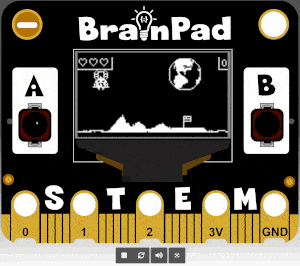

# Lunar Lander

## Step 1 @unplugged

The Lunar Lander game is a complete game example that demonstrates how animation, gravity and projectiles work inside the game engine. Look at the code and download the game to your BrainPad Pulse to see how it works. Press the A button to fire thrusters. Press B button for reverse thrusters. Try to land your ship on the landing pad with the flag. Press "Done" to exit the tutorial and modify the code.



```template
enum SpriteKind {
    Player,
    Enemy,
    Pad,
    Thrust
}
function resart () {
    let item = 0
    lunarMountain1 = sprites.createProjectile(img`
        ................................
        ................................
        ................................
        ................................
        ................................
        ................................
        ................................
        ................................
        ................................
        ................................
        ................................
        ................................
        ...................1............
        ................11111...........
        ..............11111111..........
        .............11111111111.1......
        ..........1111111111111111......
        .....111..111111111111111111....
        ...111...1111111111111111111....
        .1111..1111111111111111111111...
        11111.111111111111111111111111..
        111..1111111111111111111111111..
        11...111111111111111111111111111
        1...1111111111111111111111111111
        ...11111111111111111111111111111
        ................................
        ................................
        ................................
        ................................
        ................................
        ................................
        ................................
        `, -10, 0, SpriteKind.Enemy)
    lunarMountain2 = sprites.createProjectile(img`
        ................................
        ................................
        ................................
        ................................
        ................................
        ..........1.....................
        ..........1.....................
        ........1111....................
        .......11111....................
        ......1111111...................
        .....11111111...................
        .....11111111..........11.......
        ....111111111111.....11111......
        ...1111111111111...1.1111111....
        ..111111111111111..1111111111...
        .11111111111111111111111111111..
        111111111111111111111111111111..
        111111111111111111111111111111..
        1111111111111111111111111111111.
        111111111111111111111111..11111.
        111111111111111111111111...11111
        11111111111111111111111..1.11111
        1111111111111111111111...1..1111
        111111111111111111111...111..111
        11111111111111111111..111111..11
        11111111111111111111.111111111.1
        1111111111111111111..111111111..
        1111111111111111111.11111111111.
        111111111111111111.111111111111.
        11111111111111111..1111111111111
        11111111111111111.11111111111111
        11111111111111111.11111111111111
        `, -15, 0, SpriteKind.Enemy)
    landingPad = sprites.createProjectile(img`
        ................................
        ............1111111.............
        ............1.1...1.............
        ............1111111.............
        ............1.....1.............
        ............1111111.............
        ............1...................
        ............1...................
        ............1...................
        ............1...................
        ............1...................
        ..1111111111111111111111111111..
        .111111111111111111111111111111.
        11111111111111111111111111111111
        11111111111111111111111111111111
        11111111111111111111111111111111
        `, -5, 0, SpriteKind.Pad)
    Lander.setPosition(20, 0)
    lunarMountain1.setPosition(120, 60)
    lunarMountain2.setPosition(120, 60)
    landingPad.setPosition(120, 57)
    Lander.vy = 20
}
sprites.onOverlap(SpriteKind.Player, SpriteKind.Pad, function (Lander, landingPad) {
    landingPad.destroy()
    info.changeScoreBy(1)
    resart()
})
input.buttonA.onEvent(ButtonEvent.Down, function () {
    Lander.vy += -5
    projectile = sprites.createProjectile(img`
        . . . . . . . . . . . . . . . . 
        . . . . . . . . . . . . . . . . 
        . . . . . . . . . . . . . . . . 
        . . . . . . . . . . . . . . . . 
        . . . . . . . . . . . . . . . . 
        . . . . . . . 1 1 . . . . . . . 
        . . . . . . 1 . . 1 . . . . . . 
        . . . . . 1 . . . . 1 . . . . . 
        . . . . 1 . . 1 1 . . 1 . . . . 
        . . . . 1 1 1 1 1 1 1 1 . . . . 
        . . . . 1 1 . . . . 1 1 . . . . 
        . . . . 1 1 . 1 1 . 1 1 . . . . 
        . . . . 1 1 . 1 1 . . 1 . . . . 
        . . . . 1 1 1 1 1 1 1 1 . . . . 
        . . . . . 1 1 . . 1 1 . . . . . 
        . . . . . . 1 . . 1 . . . . . . 
        `, 5, 15, SpriteKind.Thrust, Lander)
    pause(200)
    projectile.destroy()
})
sprites.onOverlap(SpriteKind.Player, SpriteKind.Enemy, function (Lander, lunarMountain1) {
    Lander.setPosition(20, 0)
    info.changeLifeBy(-1)
    resart()
})
input.buttonB.onEvent(ButtonEvent.Down, function () {
    Lander.vy += 5
    projectile = sprites.createProjectile(img`
        . . . . . . . . . . . . . . . . 
        . . . . . . . . . . . . . . . . 
        . . . . . . . . . . . . . . . . 
        . . . . . . . . . . . . . . . . 
        . . . . . . . . . . . . . . . . 
        . . . . . . . 1 1 . . . . . . . 
        . . . . . . 1 . . 1 . . . . . . 
        . . . . . 1 . . . . 1 . . . . . 
        . . . . 1 . . 1 1 . . 1 . . . . 
        . . . . 1 1 1 1 1 1 1 1 . . . . 
        . . . . 1 1 . . . . 1 1 . . . . 
        . . . . 1 1 . 1 1 . 1 1 . . . . 
        . . . . 1 1 . 1 1 . . 1 . . . . 
        . . . . 1 1 1 1 1 1 1 1 . . . . 
        . . . . . 1 1 . . 1 1 . . . . . 
        . . . . . . 1 . . 1 . . . . . . 
        `, 5, -15, SpriteKind.Thrust, Lander)
    pause(200)
    projectile.destroy()
})
let projectile: Sprite = null
let landingPad: Sprite = null
let lunarMountain2: Sprite = null
let lunarMountain1: Sprite = null
let Lander: Sprite = null
scene.setBackgroundImage(img`
    ................................................................................................................................
    ......................................................................................33333333333...............................
    ....................................................................................333333333333.33.............................
    ...................................................................................33333333333333.33............................
    ..................................................................................33333333333333333.3...........................
    .................................................................................3.333333333333333...3..........................
    ................................................................................3..333333333333333....3.........................
    ...............................................................................3..33333333...333.3.....3........................
    ...............................................................................3..3.33333333....3......3........................
    ..............................................................................3...3.3333333.33333.......3.......................
    ..............................................................................3.....3333333333333.....333.......................
    ..............................................................................3.....333333333..........33.......................
    ..............................................................................3......33...33............3.......................
    ..............................................................................3......33....3............3.......................
    ..............................................................................3.......33...3............3.......................
    ..............................................................................3......3333...............3.......................
    ..............................................................................3....33333333.............3.......................
    ..............................................................................3....333333333...........33.......................
    ..............................................................................3....3333333333..........33.......................
    ..............................................................................3...333333333333.......3333.......................
    ...............................................................................3..333333333333.......333........................
    ...............................................................................3..333333333333.......333........................
    ................................................................................3..333333333.........33.........................
    .................................................................................3.3333333...........3..........................
    ..................................................................................3333333...........3...........................
    ...................................................................................333333..........3............................
    ....................................................................................333..........33.............................
    ......................................................................................33333333333...............................
    ................................................................................................................................
    ................................................................................................................................
    ................................................................................................................................
    ................................................................................................................................
    ................................................................................................................................
    ................................................................................................................................
    ................................................................................................................................
    ................................................................................................................................
    ................................................................................................................................
    ................................................................................................................................
    ................................................................................................................................
    ................................................................................................................................
    ................................................................................................................................
    ................................................................................................................................
    ................................................................................................................................
    ................................................................................................................................
    ................................................................................................................................
    ................................................................................................................................
    ................................................................................................................................
    ................................................................................................................................
    ................................................................................................................................
    ................................................................................................................................
    ................................................................................................................................
    ................................................................................................................................
    ................................................................................................................................
    ................................................................................................................................
    ................................................................................................................................
    ................................................................................................................................
    ................................................................................................................................
    ................................................................................................................................
    ................................................................................................................................
    ................................................................................................................................
    ...............................................................333..............................................................
    ............................333..............................333.333............................................................
    .....3.3..333333333333....33.3.3..3333333333333333333....33333333333333.333333333333333333333333333333333.3.....3.3....3333333..
    333333333333..3.....33333333333333...333333.........333333..3...333333333333333........3....33333.......3333333333333333......33
    `)
info.setLife(3)
info.setScore(0)
Lander = sprites.create(img`
    . . . . . . . . . . . . . . . . 
    . . . . 1 . . . . . . 1 . . . . 
    . . . 1 . 1 1 1 1 1 1 . 1 . . . 
    . . 1 . . 1 . . . . 1 . . 1 . . 
    . . 1 1 1 1 . . . . 1 1 1 1 . . 
    . . 1 . . 1 . . . . 1 . . 1 . . 
    . . 1 1 1 1 . 1 . . 1 1 1 1 . . 
    . . 1 . . 1 . 1 . . 1 . . 1 . . 
    . . . 1 . 1 1 1 1 1 1 . 1 . . . 
    . . . . 1 1 1 1 1 1 1 1 . . . . 
    . . . 1 . . . 1 . . . . 1 . . . 
    . . . 1 1 1 1 1 1 1 1 1 1 . . . 
    . . 1 . . . . 1 . . . . . 1 . . 
    . . 1 1 . . . 1 . . . . 1 1 . . 
    . . 1 . . . 1 1 1 . . . . 1 . . 
    . 1 1 1 . . . . . . . . 1 1 1 . 
    `, SpriteKind.Player)
resart()
game.onUpdateInterval(100, function () {
    if (Lander.y > 55) {
        pause(100)
        Lander.setPosition(20, 0)
        info.changeLifeBy(-1)
    }
    Lander.vy += 1
})

```