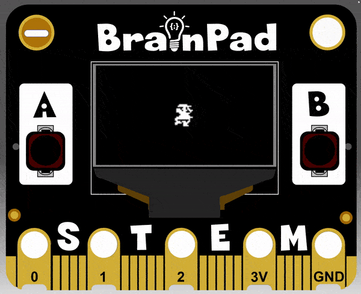
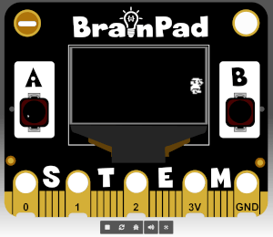
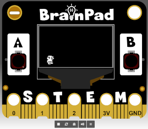

```template
enum SpriteKind {
    Player,
    Enemy
}
enum ActionKind {
    Walking,
    Idle,
    Jumping
}
let Jumper = sprites.create(img`
    . . . . . . . . . . . . . . . . 
    . . . . . 1 1 1 1 1 1 . . . . . 
    . . . . 1 1 1 1 1 1 1 1 1 1 . . 
    . . . . . . . . 1 1 . 1 . . . . 
    . . . 1 1 1 . 1 1 1 . 1 1 1 . . 
    . . . 1 1 1 . . 1 1 1 . 1 1 1 . 
    . . . 1 1 1 1 1 1 1 . . . 1 . . 
    . . . . . 1 1 1 1 1 1 1 1 . . . 
    . . . . 1 1 1 1 1 1 1 . . . . . 
    . . . 1 1 1 1 1 1 1 1 1 . . . . 
    . . . 1 1 . . . 1 1 1 1 . . . . 
    . . . 1 1 . . 1 1 1 1 1 . . . . 
    . . . 1 1 . . 1 1 1 1 1 . . . . 
    . . . . 1 1 . 1 1 . 1 . . . . . 
    . . . . . 1 1 1 . 1 1 1 . . . . 
    . . . . . 1 1 1 1 1 . . . . . . 
    `, SpriteKind.Player)
let anim = animation.createAnimation(ActionKind.Walking, 200)
anim.addAnimationFrame(img`
    . . . . 1 1 1 1 1 1 . . . . . . 
    . . . 1 1 1 1 1 1 1 1 1 1 . . . 
    . . . . . . . 1 1 . 1 . . . . . 
    . . 1 1 1 . 1 1 1 . 1 1 . . . . 
    . . 1 1 1 1 . 1 1 1 . 1 1 1 . . 
    . . 1 1 1 1 1 1 1 . . . 1 . . . 
    . . . . 1 1 1 1 1 1 1 1 . . . . 
    . . . . . 1 1 1 1 1 1 . . . . . 
    . . . . 1 1 1 1 1 1 1 1 . . . . 
    . . 1 1 1 1 1 1 1 1 1 1 1 1 . . 
    . 1 1 1 1 1 1 1 1 1 1 1 . . . . 
    . 1 1 . . . . . . . . 1 . . . . 
    . . 1 1 1 . 1 1 1 . 1 1 . . . . 
    . 1 1 1 1 1 . 1 1 1 1 . . . . . 
    . 1 1 . . . . 1 1 1 . . . . . . 
    . . . . . . . 1 1 1 1 . . . . . 
    `)
anim.addAnimationFrame(img`
    . . . . 1 1 1 1 1 1 . . . . . . 
    . . . 1 1 1 1 1 1 1 1 1 1 . . . 
    . . . . . . . 1 1 . 1 . . . . . 
    . . 1 1 1 . 1 1 1 . 1 1 . . . . 
    . . 1 1 1 1 . 1 1 1 . 1 1 1 . . 
    . . 1 1 1 1 1 1 1 . . . 1 . . . 
    . . . . 1 1 1 1 1 1 1 1 . . . . 
    . . . . . 1 1 1 1 1 1 . . . . . 
    . . . . 1 1 1 1 1 1 1 1 . . . . 
    . . 1 1 1 1 1 1 1 1 1 1 1 1 . . 
    . 1 1 1 1 1 1 1 1 1 1 1 . . . . 
    . 1 1 . . . . . . . . 1 . . . . 
    . . 1 1 1 . 1 1 1 . 1 1 . . . . 
    . 1 1 1 1 1 . 1 1 1 1 . . . . . 
    . 1 1 . . . . 1 1 1 . . . . . . 
    . . . . . . . 1 1 1 1 . . . . . 
    `)
anim.addAnimationFrame(img`
    . . . . . . . . . . . . . . . . 
    . . . . 1 1 1 1 1 1 . . . . . . 
    . . . 1 1 1 1 1 1 1 1 1 1 . . . 
    . . . . . . . 1 1 . 1 . . . . . 
    . . 1 1 1 . 1 1 1 . 1 1 1 . . . 
    . . 1 1 1 . . 1 1 1 . 1 1 1 . . 
    . . 1 1 1 1 1 1 1 . . . 1 . . . 
    . . . . 1 1 1 1 1 1 1 1 . . . . 
    . . . 1 1 1 1 1 1 1 . . . . . . 
    . . 1 1 1 1 1 1 1 1 1 . . . . . 
    . . 1 1 1 1 1 1 1 1 1 . . . . . 
    . . 1 1 . . . . . . 1 . . . . . 
    . . 1 . 1 1 1 1 . 1 . . . . . . 
    . . . 1 1 1 . 1 1 1 1 1 . . . . 
    . . . . 1 1 . . 1 1 1 1 . . . . 
    . . . . 1 1 1 1 . . . . . . . . 
    `)
anim.addAnimationFrame(img`
    . . . . . 1 1 1 1 1 1 . . . . . 
    . . . . 1 1 1 1 1 1 1 1 1 1 . . 
    . . . . . . . . 1 1 . 1 . . . . 
    . . . 1 1 1 . 1 1 1 . 1 1 1 . . 
    . . . 1 1 1 . . 1 1 1 . 1 1 1 . 
    . . . 1 1 1 1 1 1 1 . . . 1 . . 
    . . . . . 1 1 1 1 1 1 1 1 . . . 
    . . 1 1 1 1 1 1 1 1 1 1 . . . . 
    1 1 1 1 1 1 1 1 1 1 1 1 1 1 1 . 
    1 1 1 1 . 1 1 1 1 1 1 1 1 1 1 . 
    1 1 . . 1 1 1 1 1 1 1 1 . . . . 
    . . . 1 . . . . . . . 1 . 1 1 . 
    . . 1 1 . 1 1 1 1 1 . . 1 1 1 . 
    . . 1 1 1 1 1 . . . 1 1 1 1 1 . 
    . . 1 1 . . . . . . . . . . . . 
    . . 1 1 1 1 . . . . . . . . . . 
    `)
animation.attachAnimation(Jumper, anim)
animation.setAction(Jumper, ActionKind.Walking)

```

# Moving Sprites

## Step 1 @unplugged

We've got our sprite animated, now let's use the buttons to control it and make our player jump. 




## Step 2 @fullscreen

Moving sprites can be done two different ways. If we just want to move back and forth we can just use the ``sprites:control sprite`` block. Drag in the ``sprites:control sprite`` block to the bottom of the existing blocks, and change the sprite we're controlling to "Jumper".

```blocks
enum SpriteKind {
    Player,
    Enemy
}
enum ActionKind {
    Walking,
    Idle,
    Jumping
}
let Jumper = sprites.create(img`
    . . . . . . . . . . . . . . . . 
    . . . . . 1 1 1 1 1 1 . . . . . 
    . . . . 1 1 1 1 1 1 1 1 1 1 . . 
    . . . . . . . . 1 1 . 1 . . . . 
    . . . 1 1 1 . 1 1 1 . 1 1 1 . . 
    . . . 1 1 1 . . 1 1 1 . 1 1 1 . 
    . . . 1 1 1 1 1 1 1 . . . 1 . . 
    . . . . . 1 1 1 1 1 1 1 1 . . . 
    . . . . 1 1 1 1 1 1 1 . . . . . 
    . . . 1 1 1 1 1 1 1 1 1 . . . . 
    . . . 1 1 . . . 1 1 1 1 . . . . 
    . . . 1 1 . . 1 1 1 1 1 . . . . 
    . . . 1 1 . . 1 1 1 1 1 . . . . 
    . . . . 1 1 . 1 1 . 1 . . . . . 
    . . . . . 1 1 1 . 1 1 1 . . . . 
    . . . . . 1 1 1 1 1 . . . . . . 
    `, SpriteKind.Player)
let anim = animation.createAnimation(ActionKind.Walking, 200)
anim.addAnimationFrame(img`
    . . . . 1 1 1 1 1 1 . . . . . . 
    . . . 1 1 1 1 1 1 1 1 1 1 . . . 
    . . . . . . . 1 1 . 1 . . . . . 
    . . 1 1 1 . 1 1 1 . 1 1 . . . . 
    . . 1 1 1 1 . 1 1 1 . 1 1 1 . . 
    . . 1 1 1 1 1 1 1 . . . 1 . . . 
    . . . . 1 1 1 1 1 1 1 1 . . . . 
    . . . . . 1 1 1 1 1 1 . . . . . 
    . . . . 1 1 1 1 1 1 1 1 . . . . 
    . . 1 1 1 1 1 1 1 1 1 1 1 1 . . 
    . 1 1 1 1 1 1 1 1 1 1 1 . . . . 
    . 1 1 . . . . . . . . 1 . . . . 
    . . 1 1 1 . 1 1 1 . 1 1 . . . . 
    . 1 1 1 1 1 . 1 1 1 1 . . . . . 
    . 1 1 . . . . 1 1 1 . . . . . . 
    . . . . . . . 1 1 1 1 . . . . . 
    `)
anim.addAnimationFrame(img`
    . . . . 1 1 1 1 1 1 . . . . . . 
    . . . 1 1 1 1 1 1 1 1 1 1 . . . 
    . . . . . . . 1 1 . 1 . . . . . 
    . . 1 1 1 . 1 1 1 . 1 1 . . . . 
    . . 1 1 1 1 . 1 1 1 . 1 1 1 . . 
    . . 1 1 1 1 1 1 1 . . . 1 . . . 
    . . . . 1 1 1 1 1 1 1 1 . . . . 
    . . . . . 1 1 1 1 1 1 . . . . . 
    . . . . 1 1 1 1 1 1 1 1 . . . . 
    . . 1 1 1 1 1 1 1 1 1 1 1 1 . . 
    . 1 1 1 1 1 1 1 1 1 1 1 . . . . 
    . 1 1 . . . . . . . . 1 . . . . 
    . . 1 1 1 . 1 1 1 . 1 1 . . . . 
    . 1 1 1 1 1 . 1 1 1 1 . . . . . 
    . 1 1 . . . . 1 1 1 . . . . . . 
    . . . . . . . 1 1 1 1 . . . . . 
    `)
anim.addAnimationFrame(img`
    . . . . . . . . . . . . . . . . 
    . . . . 1 1 1 1 1 1 . . . . . . 
    . . . 1 1 1 1 1 1 1 1 1 1 . . . 
    . . . . . . . 1 1 . 1 . . . . . 
    . . 1 1 1 . 1 1 1 . 1 1 1 . . . 
    . . 1 1 1 . . 1 1 1 . 1 1 1 . . 
    . . 1 1 1 1 1 1 1 . . . 1 . . . 
    . . . . 1 1 1 1 1 1 1 1 . . . . 
    . . . 1 1 1 1 1 1 1 . . . . . . 
    . . 1 1 1 1 1 1 1 1 1 . . . . . 
    . . 1 1 1 1 1 1 1 1 1 . . . . . 
    . . 1 1 . . . . . . 1 . . . . . 
    . . 1 . 1 1 1 1 . 1 . . . . . . 
    . . . 1 1 1 . 1 1 1 1 1 . . . . 
    . . . . 1 1 . . 1 1 1 1 . . . . 
    . . . . 1 1 1 1 . . . . . . . . 
    `)
anim.addAnimationFrame(img`
    . . . . . 1 1 1 1 1 1 . . . . . 
    . . . . 1 1 1 1 1 1 1 1 1 1 . . 
    . . . . . . . . 1 1 . 1 . . . . 
    . . . 1 1 1 . 1 1 1 . 1 1 1 . . 
    . . . 1 1 1 . . 1 1 1 . 1 1 1 . 
    . . . 1 1 1 1 1 1 1 . . . 1 . . 
    . . . . . 1 1 1 1 1 1 1 1 . . . 
    . . 1 1 1 1 1 1 1 1 1 1 . . . . 
    1 1 1 1 1 1 1 1 1 1 1 1 1 1 1 . 
    1 1 1 1 . 1 1 1 1 1 1 1 1 1 1 . 
    1 1 . . 1 1 1 1 1 1 1 1 . . . . 
    . . . 1 . . . . . . . 1 . 1 1 . 
    . . 1 1 . 1 1 1 1 1 . . 1 1 1 . 
    . . 1 1 1 1 1 . . . 1 1 1 1 1 . 
    . . 1 1 . . . . . . . . . . . . 
    . . 1 1 1 1 . . . . . . . . . . 
    `)
animation.attachAnimation(Jumper, anim)
animation.setAction(Jumper, ActionKind.Walking)
sprites.controlSprite(Jumper, 100, 100)
```

## Step 3 @unplugged

You can either download the code to the BrainPad or you can try it on the simulator. You'll notice that our sprite moves back and forth when we press the A or B buttons. 



## Step 4 @fullscreen
Now let's use a ``||input:on button||`` event block to control our sprite's movement instead of the one we previously used. Remove the last block we added to move our sprite and drag it to the menu to delete it. Drag in two ``||input:on button||`` event blocks. Set one to "pressed" and the other to "released". 

```blocks
input.buttonA.onEvent(ButtonEvent.Down, function () {
	
})
input.buttonA.onEvent(ButtonEvent.Up, function () {
	
})
```

## Step 5 @fullscreen

First let's position our jumper near the bottom of the screen where we want him to do his jumping. We do this by dragging in the ``||sprites:set position||`` block into the ``||loops:on start||`` block at the bottom. Make sure to change the name to our "Jumper" sprite and set the x to 20 and the y to 55. This will put our Jumper at the bottom of the screen slightly to the left. 

```blocks
enum SpriteKind {
    Player,
    Enemy
}
enum ActionKind {
    Walking,
    Idle,
    Jumping
}
let Jumper = sprites.create(img`
    . . . . . . . . . . . . . . . . 
    . . . . . 1 1 1 1 1 1 . . . . . 
    . . . . 1 1 1 1 1 1 1 1 1 1 . . 
    . . . . . . . . 1 1 . 1 . . . . 
    . . . 1 1 1 . 1 1 1 . 1 1 1 . . 
    . . . 1 1 1 . . 1 1 1 . 1 1 1 . 
    . . . 1 1 1 1 1 1 1 . . . 1 . . 
    . . . . . 1 1 1 1 1 1 1 1 . . . 
    . . . . 1 1 1 1 1 1 1 . . . . . 
    . . . 1 1 1 1 1 1 1 1 1 . . . . 
    . . . 1 1 . . . 1 1 1 1 . . . . 
    . . . 1 1 . . 1 1 1 1 1 . . . . 
    . . . 1 1 . . 1 1 1 1 1 . . . . 
    . . . . 1 1 . 1 1 . 1 . . . . . 
    . . . . . 1 1 1 . 1 1 1 . . . . 
    . . . . . 1 1 1 1 1 . . . . . . 
    `, SpriteKind.Player)
let anim = animation.createAnimation(ActionKind.Walking, 200)
anim.addAnimationFrame(img`
    . . . . 1 1 1 1 1 1 . . . . . . 
    . . . 1 1 1 1 1 1 1 1 1 1 . . . 
    . . . . . . . 1 1 . 1 . . . . . 
    . . 1 1 1 . 1 1 1 . 1 1 . . . . 
    . . 1 1 1 1 . 1 1 1 . 1 1 1 . . 
    . . 1 1 1 1 1 1 1 . . . 1 . . . 
    . . . . 1 1 1 1 1 1 1 1 . . . . 
    . . . . . 1 1 1 1 1 1 . . . . . 
    . . . . 1 1 1 1 1 1 1 1 . . . . 
    . . 1 1 1 1 1 1 1 1 1 1 1 1 . . 
    . 1 1 1 1 1 1 1 1 1 1 1 . . . . 
    . 1 1 . . . . . . . . 1 . . . . 
    . . 1 1 1 . 1 1 1 . 1 1 . . . . 
    . 1 1 1 1 1 . 1 1 1 1 . . . . . 
    . 1 1 . . . . 1 1 1 . . . . . . 
    . . . . . . . 1 1 1 1 . . . . . 
    `)
anim.addAnimationFrame(img`
    . . . . 1 1 1 1 1 1 . . . . . . 
    . . . 1 1 1 1 1 1 1 1 1 1 . . . 
    . . . . . . . 1 1 . 1 . . . . . 
    . . 1 1 1 . 1 1 1 . 1 1 . . . . 
    . . 1 1 1 1 . 1 1 1 . 1 1 1 . . 
    . . 1 1 1 1 1 1 1 . . . 1 . . . 
    . . . . 1 1 1 1 1 1 1 1 . . . . 
    . . . . . 1 1 1 1 1 1 . . . . . 
    . . . . 1 1 1 1 1 1 1 1 . . . . 
    . . 1 1 1 1 1 1 1 1 1 1 1 1 . . 
    . 1 1 1 1 1 1 1 1 1 1 1 . . . . 
    . 1 1 . . . . . . . . 1 . . . . 
    . . 1 1 1 . 1 1 1 . 1 1 . . . . 
    . 1 1 1 1 1 . 1 1 1 1 . . . . . 
    . 1 1 . . . . 1 1 1 . . . . . . 
    . . . . . . . 1 1 1 1 . . . . . 
    `)
anim.addAnimationFrame(img`
    . . . . . . . . . . . . . . . . 
    . . . . 1 1 1 1 1 1 . . . . . . 
    . . . 1 1 1 1 1 1 1 1 1 1 . . . 
    . . . . . . . 1 1 . 1 . . . . . 
    . . 1 1 1 . 1 1 1 . 1 1 1 . . . 
    . . 1 1 1 . . 1 1 1 . 1 1 1 . . 
    . . 1 1 1 1 1 1 1 . . . 1 . . . 
    . . . . 1 1 1 1 1 1 1 1 . . . . 
    . . . 1 1 1 1 1 1 1 . . . . . . 
    . . 1 1 1 1 1 1 1 1 1 . . . . . 
    . . 1 1 1 1 1 1 1 1 1 . . . . . 
    . . 1 1 . . . . . . 1 . . . . . 
    . . 1 . 1 1 1 1 . 1 . . . . . . 
    . . . 1 1 1 . 1 1 1 1 1 . . . . 
    . . . . 1 1 . . 1 1 1 1 . . . . 
    . . . . 1 1 1 1 . . . . . . . . 
    `)
anim.addAnimationFrame(img`
    . . . . . 1 1 1 1 1 1 . . . . . 
    . . . . 1 1 1 1 1 1 1 1 1 1 . . 
    . . . . . . . . 1 1 . 1 . . . . 
    . . . 1 1 1 . 1 1 1 . 1 1 1 . . 
    . . . 1 1 1 . . 1 1 1 . 1 1 1 . 
    . . . 1 1 1 1 1 1 1 . . . 1 . . 
    . . . . . 1 1 1 1 1 1 1 1 . . . 
    . . 1 1 1 1 1 1 1 1 1 1 . . . . 
    1 1 1 1 1 1 1 1 1 1 1 1 1 1 1 . 
    1 1 1 1 . 1 1 1 1 1 1 1 1 1 1 . 
    1 1 . . 1 1 1 1 1 1 1 1 . . . . 
    . . . 1 . . . . . . . 1 . 1 1 . 
    . . 1 1 . 1 1 1 1 1 . . 1 1 1 . 
    . . 1 1 1 1 1 . . . 1 1 1 1 1 . 
    . . 1 1 . . . . . . . . . . . . 
    . . 1 1 1 1 . . . . . . . . . . 
    `)
animation.attachAnimation(Jumper, anim)
animation.setAction(Jumper, ActionKind.Walking)
Jumper.setPosition(20, 55)
```

## Step 6 @fullscreen
Now let's make our Jumper jump! In this tutorial we're only going to change the position of the sprite rather than using physic to make the sprite jump. In later tutorials we'll use velocity and gravity to control sprite movement. Inside each ``||input:on button||`` event block, drag in a ``||sprite: change mySprite position||`` block. Change the sprite we're controlling to "Jumper" and both blocks to "y (vertical position)". In our "released" event change the value to 20, and in the "pressed" event change the value to -20. Download to the BrainPad or try on the simulator. 

```blocks
input.buttonA.onEvent(ButtonEvent.Down, function () {
    Jumper.y += -20
})
input.buttonA.onEvent(ButtonEvent.Up, function () {
    Jumper.y += 20
})
```

## Step 7 @unplugged
Our Jumper is now jumping, in the next tutorial we'll give him something to jump over. 



